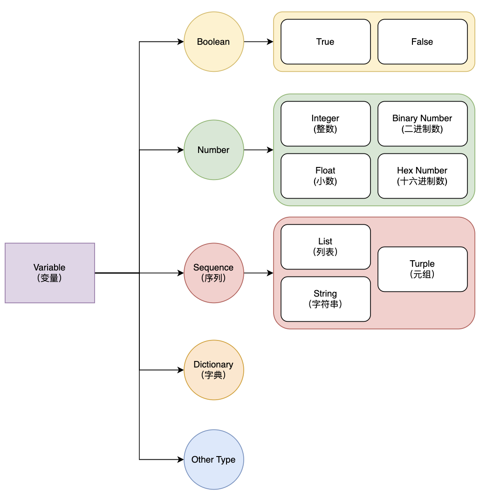
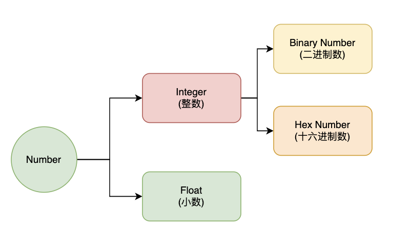

- [Overview of Variable](#overview-of-variable)
- [The Variable define Rule](#the-variable-define-rule)
  - [Variable name](#variable-name)
    - [CamelCase](#camelcase)
    - [snake\_case](#snake_case)
  - [Assignment Operator](#assignment-operator)
  - [How is code actually work?](#how-is-code-actually-work)
  - [Augmented assignment](#augmented-assignment)
- [Variable Type: Number](#variable-type-number)
  - [Division:](#division)
  - [Floor division:](#floor-division)
  - [Remainder](#remainder)
  - [Exponents](#exponents)
  - [Prority of Operations](#prority-of-operations)
- [Summary](#summary)


# Overview of Variable

The variable in math:
$$
  f(x) = x^3 + 2x + 3
$$
The x here is the variable, which can be assigned by any number.

However, the Variable in computer science can be lots of type. It can be Boolean, Number, Sequence ...




**Example: The varibale in Computer Science**

```python
x = 3
y = x + 2
print(y)
```

```python
x = 'abcdefg'   # A sting should inside the '' 
y = x + 'e'
print(y)
```

# The Variable define Rule

## Variable name

A variable name must start with a letter or the underscore character ( _ ). A variable name cannot start with a number. A variable name can only contain alpha-numeric characters and underscores (A-z, 0-9, and _ ). Variable names are case-sensitive (age, "Age", "AGE" and "age" are three different variables).

**Exmaple: Varibale Name**

Which of the following variable name is valid?

```
a. 0_counter
b. __name
c. rtn_98
d. A_bc_def
e. algo-ace
```

### CamelCase
This format indicates the separation of words with a single capitalized letter

```
a. myStudentCount
b. ServiceDiscovery
```

### snake_case

Each space is replaced with an underscore (\_) character

```
c. get_status_code_when_request_is_valid
d. CLIENT_CONNECT_SERVER_FAILURE
```

## Assignment Operator

Python does not require to declare the type of varibles. The variable's type and value are initialized at the moment of assignment. Variable assignment is performed with the equal sign (=).

```Python
>>> a = 231
>>> s = "Hello guys"
>>> b = a + 2.0 # => 233.0
>>> c = d = 2 + 3
>>> e, f = 101, 203 # assign multiple variables at once
```

## How is code actually work?

Consider the below code, what is the final value of x?
```python
x = 2
y = x
x = 3
```

a) 2

b) 3

when ```x = 2``` executed, a box is created and labelled ```x```.


After we execute ```y = x```, the value in x's box is copied to y's box. If a new value is assigned to one of the variables, the variables no longer share a value. Only one variable's value is changed. The other is unchanged.

**Exercise: Assignemnt**

Which the value of x after the following code is excuted?

```Python
>>> s = "A test String"
>>> x = var = 100 + 2
>>> var = var - 10
>>> s = x * 10
>>> x = s + var
>>> print(x)
```
## Augmented assignment

```Python
>>> x = 1.2
>>> x += 1 # Equal to x = x + 1
>>> x *= 2 # Equal to x = x * 2
>>> x /= 4 # Equal to x = x / 4
```
**Exercise: Augmented Assignemnt**

Which the value of x, y, z  after the following code is excuted?

```Python
>>> x, y, z = 1, 2, 3
>>> x += 2
>>> y *= 3
>>> z -= 4
>>> x, y, z = y, z, x
```

|       |      |       |          |        |
| ----- | ---- | ----- | -------- | ------ |
| Int   | 2    | -3    | 0b101    | 0x80   |
| Float | 3.14 | -90.  | 1.64E-10 | 6.22e8 |
| Bool  | True | False |          |        |
|       |      |       |          |        |

# Variable Type: Number





## Division:

$$
x / y
$$

**The result is a Float** for any numerical values x and y.

```Python
>>> 1 / 2
0.5
>>> 7 / 3 # Float is not accurate
2.3333333333333335
```

## Floor division:

$$
x // y
$$

**The result is the integer part of the division**

- If x and y are both Int, the result is an Int
- If either x or y is a Float, the result is an Float, with the decimal part being .0

```Python
>>> 2 // 16 # floors result, returns integer
0
>>> 7.0 // 3 # floors result, returns float
2.0
>> -1 // 2 # reutrn an integer less than 0.5
-1
```

## Remainder

$$
x \% y = x - \lfloor\frac{x}{y}\rfloor\times y
$$

x and y should both be nature numbers.

```Python
>>> 6 % 2
0
>>> 7 % 3
1
>>> 0 % 3
0
```

What if x and y are float?

```Python
>>> 8 % 4.1
3.9000000000000004
>>> 8 % 2.1
1.6999999999999997
```

What if x and y are negative numbers?

```Python
>>> 8 % -4
0
>>> 3 % -4 # floor(3 / -4) = -1
-1
```

## Exponents

$$
x * * y
$$

Returns x raised to the power of y

```Python
>>> -2 ** 2
-4
>>> (-2) ** 2 # Parentheses can change the order of calculation
4
>>> 2 ** -1.0
0.5
>>> 2 ** 2.5
5.656854249492381
```


## Prority of Operations

Consider the following expressions:

```python
x_1 = 2 ** 3 / 3 % 2
x_2 = (2 ** 3) / (3 % 2)
```
What is the value of x_1 and x_2?

The following table summarizes all operators, from top to bottom, with decreasing prorities.
|Equatuion |Result |
|--- |--- |
|+ expr |The sign of the result does not change |
|- expr |The sign of the result will change |
|expr1 * expr2  | mult |
|expr1 /  expr2  | division|
|expr1 / /  expr2| floor division|
|expr1 % expr2  | Remainder|
|expr1 + expr2  | add |
|expr1 - expr2  | sub |

Note: The prority of ** is higher than unary operations.


**Exercise: Write a code to determine:**

$$
m = a * (\frac{p}{1200})(1 + \frac{p}{1200})^n
$$

1. What is the value of m if we let a = 750, p = 2.5, n = 10?
2. What is the value of m if we let a = 750, p = 25, n = 5?


# Summary
Why do we use **Varibale** and **Assignment Operation**?

In above example, we calculate the equation

$$
m = a * (\frac{p}{1200})(1 + \frac{p}{1200})^n
$$

However, a single change of a, p, n will require us to recalculate the whole equation.

Consider the following code, using varibale can reduce repeated operations.

```Python
a = 750
p = 2.5
n = 10

term = p / 1200
m = a * (term * (1 + term)) ** n
```
