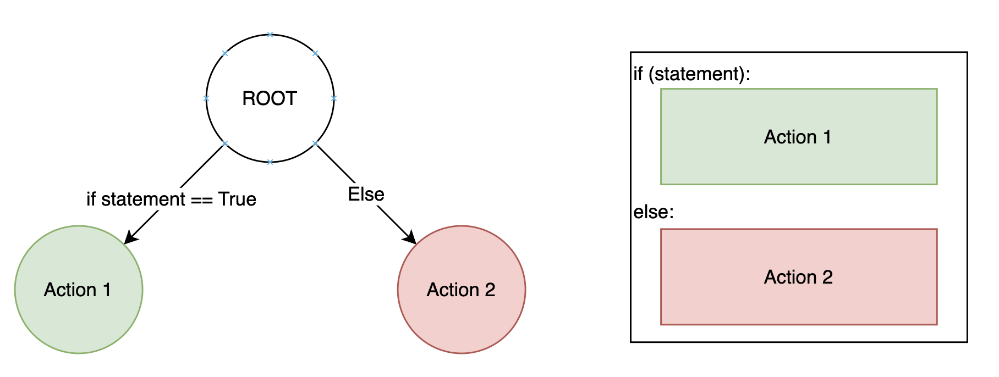
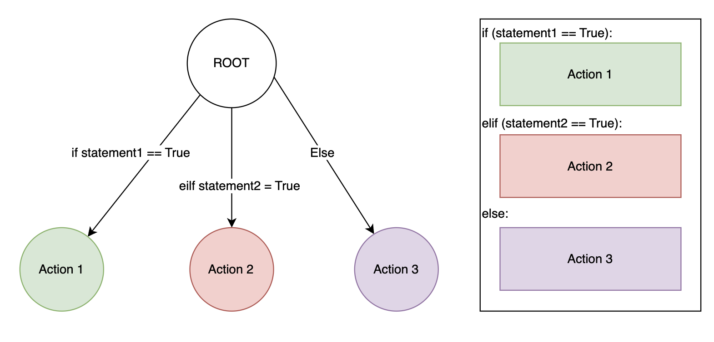

- [Variable Type: Boolean](#variable-type-boolean)
- [Control Flow](#control-flow)
  - [Basic Conditional Statement](#basic-conditional-statement)
  - [Chained Conditional Statement](#chained-conditional-statement)
  - [Ternary operator](#ternary-operator)
- [Function](#function)
  - [Function in math](#function-in-math)
  - [Function in Computer Science](#function-in-computer-science)
  - [Function Name](#function-name)
  
# Variable Type: Boolean

Python uses Short-Circuit evaluation, Evaluate from left to right, using key word "not", "and", "or".

```Python
>>> not True
False
>>> not (not False)
False
```

```Python
>>> 1 < 2
True
>>> 2 >= 4
False
>>> 5 == 8 # Python use == to determine if left equals right
False
```

```Python
>>> 1 < 2 and 2 > 4
False
>>> 1 < 2 or 2 > 4
True
```

```Python
>>> bool(0)
False
>>> bool(1)
True
>>> bool(123119)
True
```

**Example:** What is the value of the following equation?

```Python
>>> ((4>5) or (5<4) or not(3==2))
```

Python will stop evaluating as soon as answer is known

```Python
>>> True or "adjalkdnka" # True or anything is True
True
>>> False and &32-_-! # Flase and anything is False
False
```
<br/>

# Control Flow

## Basic Conditional Statement



```Python
if (statement):
    action_1        # If statement == Ture, do action_1
else:
    action_2        # Else (if statement == Flase), do action_2
```

**Example**

```Python
x = 2
if (x <= 2):    # True if x <= 2
    x += 2
else:           # True if x > 4
    x -= 2
print("The value of x is: ", x)
# The value of x is:  4
```

**Exercise: bank system**

Consider the following examples, what is this code doing?

```python
if balance > 0.00:
    if balance - amount > min_bal:
        print("Here is your cash")
else:
    print ("Your balance is zero or negative")
```

## Chained Conditional Statement



Unlike **else**, **elif** can be used multiple times.
```Python
if (statement_1):   # # If statement_1 == Ture, do action_1
    action_1
elif (statement_2): # If statement_1 == False and statement_2 is Ture, do action_2
    action_2
else:               # If statement_1 == False and statement_2 == Flase, do action_3
    action_3
```

**Example**
What is the value of y after the code is executed?

```python
x, y = -5, 3
if (x > 0):
    y = 2
elif (x > -3):
    y = 5
elif (x > -8):
    y = 10
else:
    y = 12

```

**Exersice:**
What is the final value of x and y after the each code block is executed?

```Python
x = 5
y = -1
if (x > 0):    
    x += 5
    y -= 2
elif (x > 1):
    x = -x
    y *= 2
```

```Python
x = 5
y = -1
if (x > 0):    
    x += 5
    y -= 2
if (x > 1):
    x = -x
    y *= 2
```

## Ternary operator

```Python
x, y = 4, 3
smaller = x if x < y else y
```

<br/>


**Exercise: Speed fines are not fine!**

***Problem Description***

Many communities now have “radar” signs that tell drivers what their speed is, in the hope that they will slow down.
You will output a message for a “radar” sign. 

The message will display information to a driver based on his/her speed according to the following table:

| km/h over the limit  | Fine  | 
|---|---|
|  1 to 20 | $ 100  |
| 21 to 30 $  |$ 270   |
|  31 or above | $ 500  |

***Input Specification***

The user will will give you two integers. 

First, the user will be prompted to give the speed
limit. 

Second, the user will be prompted to give the recorded speed of the car

***Output Specification***

If the driver is not speeding, the output should be:

0

If the driver is speeding, the output should be the amount of fine.

---

**Sample Input 1**

```
speed_limit = 40
recorded_speed = 39
```

**Sample Output 1**

```0```


**Sample Input 2**
```
speed_limit = 100
recorded_speed = 131
```

**Sample Output 2**

```500```

**Sample Input 3**
```
speed_limit = 100
recorded_speed = 120
```

**Sample Output 3**

```100```

---

```python
speed_limit = 40
recorded_speed = 39

fine = 0

### Write your code here


## End of your code

print(fine)


```


# Function

## Function in math

$$
f(x, y) = x^2 + y ^3 + 1
$$

The function in math has a range and domian. in the above example, the domian is $\mathbb{R}$ and the range is also $\mathbb{R}$.

## Function in Computer Science

In Python a function is defined using the ```def``` keyword, The ```x, y``` here are known as parameters. Here ```x, y``` can be any data type.


```Python
def f(x, y):
    return x ** 2 + y ** 3 + 1
```

However, The function can have as many parameters as you want.

```Python
def f():
    return 1 + 2

def f(x, y):
    return x ** 2 + y ** 3 + 1

def f(x, y, z):
    return x ** 2 + y ** 3 + z
```

A function only runs when it is called, the keyword return will output the result.

```Python
>>> a = f(2, 2)
>>> a
>>> 13
```

However, each function does not necessary need have a ```return```

```Python
def f(x, y):
    x ** 2 + y ** 3 + 1
```

Function terminates immediately after execute keyword return.

```Python
def f(x, y):
    a = x + 2 * 3
    b = y * 2 + 1
    return 

    c = 2 
    return c
```

**Consider**: What is the possible range and domain in computer science?


## Function Name

According to the PEP 8 Style Guide, function names should be lowercase, with words separated by underscores. This style is known as snake_case. Additionally, function names should be descriptive and not too long.

Here are some examples of function names following the snake_case convention:

```python
def add_numbers(a, b):
    return a + b

def convert_to_uppercase(text):
    return text.upper()

def calculate_area_of_circle(radius):
    pi = 3.14159
    return pi * radius * radius
```

<br/>

**Exercise: Speed fines are not fine! II**