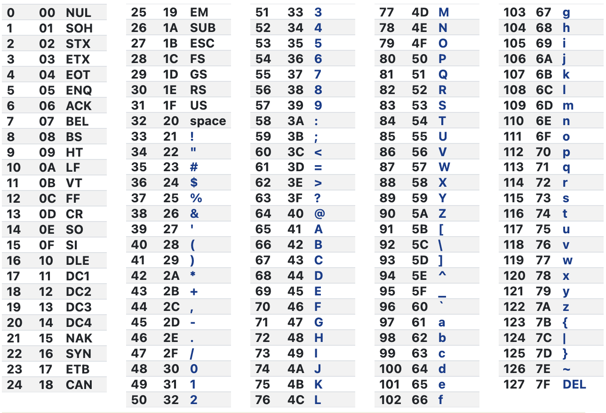
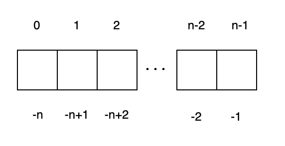

- [ASCII](#ascii)
  - [Working with ASCII Codes in Python](#working-with-ascii-codes-in-python)
  - [Special character](#special-character)
- [Sequence](#sequence)
  - [Common Sequence Type:](#common-sequence-type)
  - [Sting](#sting)
  - [List](#list)
  - [Tuple](#tuple)
  - [Common usage of Sequence](#common-usage-of-sequence)
- [Built-in methods](#built-in-methods)
  - [String Built-in methods](#string-built-in-methods)
- [List Libiary](#list-libiary)


# ASCII

ASCII (American Standard Code for Information Interchange) is a character encoding standard that represents text and control characters in computers, communication equipment, and other devices that use text. It defines a set of 128 characters, each represented by a 7-bit binary number, ranging from 0 to 127. ASCII includes letters (both uppercase and lowercase), digits, punctuation marks, whitespace characters (such as space and newline), and control characters (such as escape and delete).




## Working with ASCII Codes in Python
Python provides two built-in functions to convert between characters and their corresponding ASCII codes:

**ord(char): Returns the ASCII value of the given char.**

```python
print(ord('A'))  # Output: 65
```

**chr(ascii_code): Returns the character corresponding to the given ascii_code.**

```python
print(chr(65))  # Output: 'A'
```

**Example**:
```Python
>>> print("The ASCII value of " + 'a' + ' is', ord('a'))
The ASCII value of a is 97
>>> print("The ASCII value of " + '\\n' + ' is', ord('\n'))
The ASCII value of \n is 10
>>> print("The ASCII value of " + '\\0' + ' is', ord('\0'))
The ASCII value of \0 is 0
```

## Special character

There are some special character I want to mention here:

```Python
>>> print("abc\nabc") # \n means a new line
abc
abc
>>> print("abc\tabc") # \t means tab here
abc    abc
```

**Exercise**:


# Sequence

In Python, the three primary sequence types in Python are strings, lists, and tuples. In this section, we will discuss the properties of these sequence types, along with examples to help illustrate their usage. We'll also touch on how they are stored in memory.

## Common Sequence Type:

|        |           |                 |                    |
| ------ | --------- | --------------- | ------------------ |
| String | "Hello"   | "123"           | "0b101"            |
| Tuple  | (1, 2, 3) | (2.3, "abc", 2) | (True, "123", 123) |
| List   | [1, 2, 3] | [Flase, "abc"]  | [[2.2, 4], [3.2]]  |


## Sting

A string is a sequence of characters enclosed in single (' ') or double (" ") quotes. Strings are **immutable**, which means that once created, their contents cannot be changed. However, you can create a new string by modifying the original string.

```python
name = "John Doe"
```


## List
A list is a **mutable**, ordered collection of items enclosed in square brackets ([ ]). Lists can contain items of different data types, including other lists.

```python
fruits = ["apple", "banana", "cherry"]
```

## Tuple

A tuple is an **immutable**, ordered collection of items enclosed in round brackets (( )). Like lists, tuples can contain items of different data types

```
coordinates = (42.3601, -71.0589)
```

## Common usage of Sequence
Sequence is like a train, each box has a index, and can hold data.



**Indexing: Access an individual item in a sequence using its index (zero-based).**

```Python
text = "hello"
print(text[1])  # Output: 'e'
```

**Slicing: Extract a portion of a sequence using the slice notation (start:stop:step).**
```Python
numbers = [0, 1, 2, 3, 4, 5]
print(numbers[1:4])  # Output: [1, 2, 3]
print(numbers[1:-1]) # Output: [1, 2, 3, 4]
print(numbers[1:-1: 2])  # Output: [1, 3]
```

**Length: Determine the number of items in a sequence using the len() function.**
```Python
fruits = ["apple", "banana", "cherry"]
print(len(fruits))  # Output: 3
```

**Concatenation: Combine two sequences of the same type using the + operator.**
```Python
repeat_text = "ha"
print(repeat_text * 3)  # Output: 'hahaha'
```

**In and not in: check if the object is inside the sequence.**

```Python
seq_1 = "abc"
seq_2 = [1, 2, 3]
print('a' in seq_1) # Output: True
print(4 not in seq_2) # Output: True
```


<br/>

# Built-in methods
## String Built-in methods

https://docs.python.org/3/library/string.html

Strings in Python come with a variety of built-in methods that make string manipulation more convenient. Here are some frequently used string methods:

**upper(): Converts all characters in the string to uppercase.**

```python
text = "hello world"
print(text.upper())  # Output: 'HELLO WORLD'
```

**lower(): Converts all characters in the string to lowercase.**


```python
text = "HELLO WORLD"
print(text.lower())  # Output: 'hello world'
```

**strip(): Removes leading and trailing whitespace from the string.**


```python
text = "  hello world  "
print(text.strip())  # Output: 'hello world'
```

**replace(old, new): Replaces all occurrences of the old substring with the new substring.**


```python
text = "hello world"
print(text.replace("world", "there"))  # Output: 'hello there'
```
**split(separator): Splits the string into a list of substrings based on the specified separator.**

```python
text = "hello world"
print(text.split(" "))  # Output: ['hello', 'world']
```

**Exercise**: Happy or Sad (CCC2015 J2)

***Problem Description***

We often include emoticons in our text messages to indicate how we are feeling. The three consecutive characters ```:-)``` indicate a happy face and the three consecutive characters ```:-(``` indicate a
sad face. Write a program to determine the overall mood of a message.

***Input Specification***

There will be one line of input that contains between 1 and 255 characters.

***Output Specification***

The output is determined by the following rules:
* If the input line does not contain any happy or sad emoticons, output none.
* Otherwise, if the input line contains an equal number of happy and sad emoticons, output
unsure.
* Otherwise, if the input line contains more happy than sad emoticons, output happy.
* Otherwise, if the input line contains more sad than happy emoticons, output sad.

**Sample Input 1**

```
How are you :-) doing :-( today :-)?
```

**Output for Sample Input 1**

```
happy
```

**Sample Input 2**

```
:)
```

**Output for Sample Input 2**

```
none
```

**Sample Input 3**

```
This :-(isstr:-(:-(ange the:-)xt)
```

**Output for Sample Input 3**

```
sad
```

```python
def happy_or_sad(s):
    pass
```

**Exercise**: Find the cloest vowel

Give a engilsh character, find the closet vowel of that character.

```python
def closet_vowel(c):
    pass

c = 'c'
closet_vowel(c) # 'a'

c = 'd'
closet_vowel(c) # 'f'

c = 'z'
closet_vowel(c) # 'a'
```


<br/>

# List Libiary
Lists in Python also come with a variety of built-in methods to help you manage and manipulate them. Here are some frequently used list methods:

**append(item): Adds an item to the end of the list.**

```python
fruits = ["apple", "banana"]
fruits.append("cherry")
print(fruits)  # Output: ['apple', 'banana', 'cherry']
```

**extend(iterable): Appends the elements of an iterable (e.g., list, tuple, or string) to the end of the list.**

```python
fruits = ["apple", "banana"]
new_fruits = ["cherry", "orange"]
fruits.extend(new_fruits)
print(fruits)  # Output: ['apple', 'banana', 'cherry', 'orange']
```

**insert(index, item): Inserts an item at the specified index in the list.**

```python
fruits = ["apple", "banana"]
fruits.insert(1, "cherry")
print(fruits)  # Output: ['apple', 'cherry', 'banana']
```

**remove(item): Removes the first occurrence of item from the list.**

```python
fruits = ["apple", "banana", "cherry"]
fruits.remove("banana")
print(fruits)  # Output: ['apple', 'cherry']
```

**pop(index): Removes and returns the item at the specified index in the list. If no index is provided, it removes and returns the last item.**

```python
fruits = ["apple", "banana", "cherry"]
popped_fruit = fruits.pop(1)
print(popped_fruit)  # Output: 'banana'
print(fruits)  # Output: ['apple', 'cherry']
```

**Exercise:** Merge two list

Suppose we have two sorted list, wirte a function to merge them to a new list in sorted order.

Hint: Google python sort a list

```python
def merge(lst1, lst2):
    pass 
```

```
merge([1,, 3, 5], [2, 4, 6]) => [1, 2, 3, 4, 5, 6]
```
